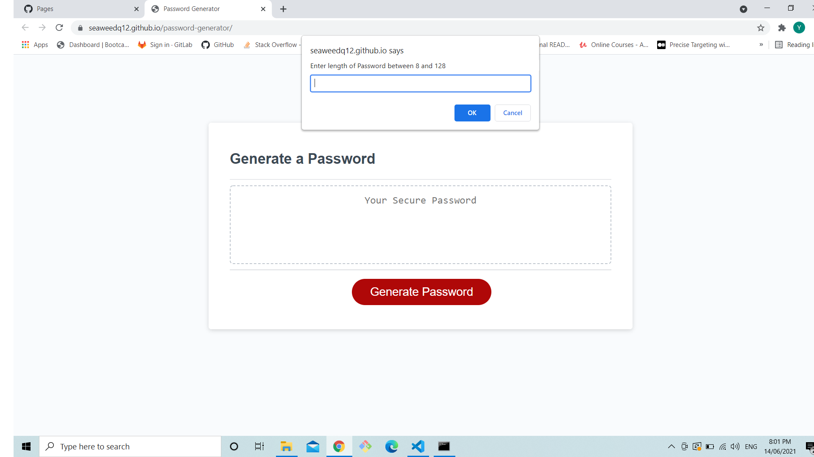
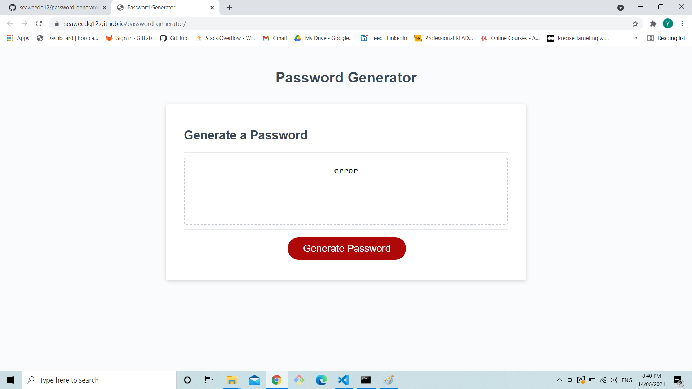
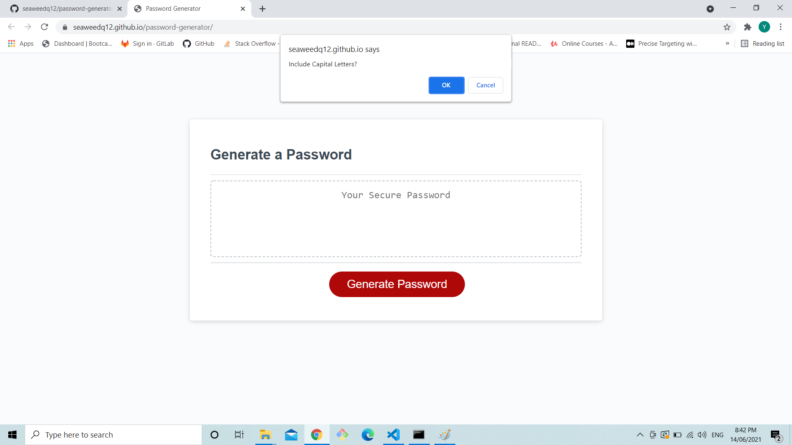
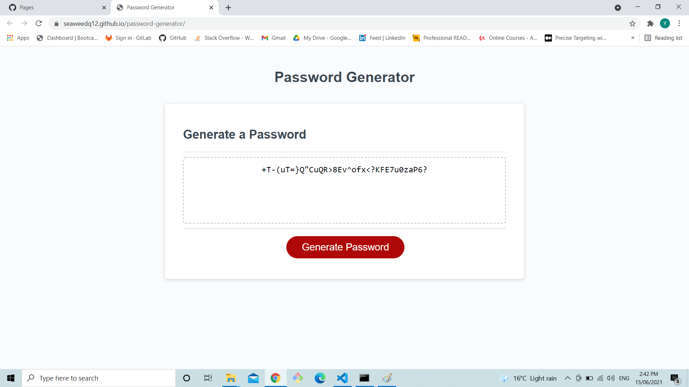

# 03 JavaScript: Password Generator

## Task

In this weeks homework we were given a starter code in which we add codes to a script.js file so that a user can generate passwords after making choice in which what the password is going to contain, for example "is the password going to contain number?"

## URL

https://seaweedq12.github.io/password-generator/a

## Work

1. Firstly when the generate button is pressed the user is prompt to a input in which the user is ask to enter the length of the password between 8 and 128 characters.

If the user cancels or places a incorrect in put the generator will return a Error message

2. If a correct input is placed then four confirms will pop in order, whether to include lowercase, uppercase, number and special letters. The user can choice include or not include with the ok and cancel button.

3. When all the confirms are chosen a password corresponding to the confirms will be showen

**Example 1** - 35 letters with lowercase and special letters

**Example 2** - 35 letters uppercase and numbers 

**Example 3** - 35 letters with everthing included
